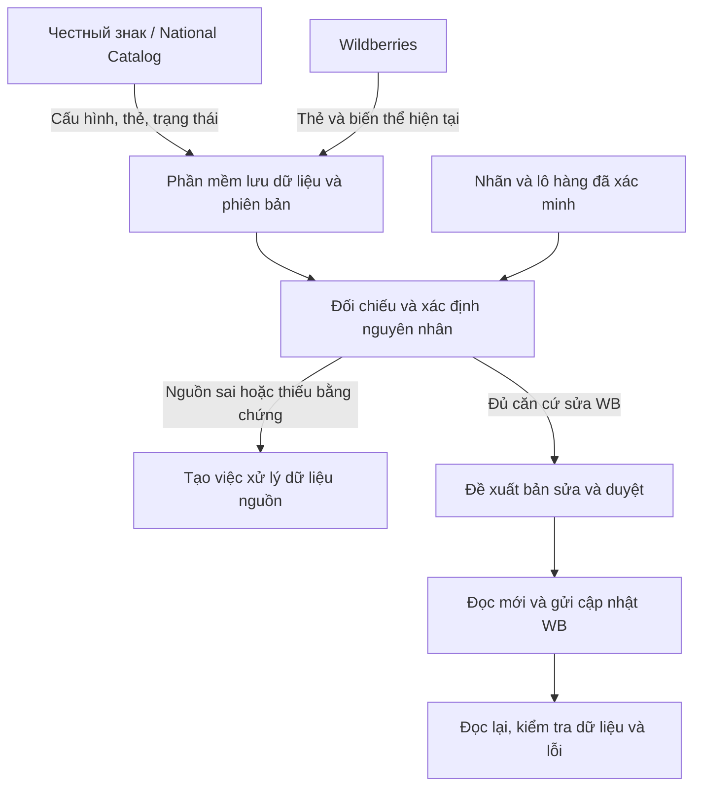

# Đặc tả triển khai đồng bộ Честный знак và Wildberries

**Dành cho:** Antigravity triển khai vào phần mềm hiện có.

**Phiên bản nội dung:** 1.0 · **Ngày đối chiếu nguồn:** 07/10/2026 · **Định dạng:** Markdown.

Tệp này chứa toàn bộ yêu cầu triển khai, thiết kế dữ liệu, quy tắc kiểm tra, API tham chiếu, quy trình đồng bộ, tiêu chí nghiệm thu và chỉ dẫn giao việc. Đưa toàn bộ tệp vào ngữ cảnh Antigravity cùng repository đang làm; mục 20 là chỉ dẫn bắt đầu.

## Mục lục

- [01 Mục tiêu và phạm vi triển khai](#section-01)
- [02 Thuật ngữ và hành trình sử dụng](#section-02)
- [03 Nguồn dữ liệu và xử lý mâu thuẫn](#section-03)
- [04 Cấu hình đi từ NK xuống phần mềm](#section-04)
- [05 Connector National Catalog](#section-05)
- [06 Nhận lỗi đăng ký và trạng thái từ NK](#section-06)
- [07 Connector Wildberries](#section-07)
- [08 Quy trình gửi bản sửa lên WB](#section-08)
- [09 Mô hình dữ liệu cần bổ sung](#section-09)
- [10 Bộ máy đề xuất GTIN và mã phân loại](#section-10)
- [11 Danh mục quy tắc kiểm tra](#section-11)
- [12 Duyệt và trạng thái xử lý](#section-12)
- [13 Màn hình và thao tác người dùng](#section-13)
- [14 Lịch đồng bộ và độ tin cậy](#section-14)
- [15 Xác thực và bảo vệ thông tin](#section-15)
- [16 Hợp đồng giữa các mô đun nội bộ](#section-16)
- [17 Kiểm thử chấp nhận dữ liệu và nghiệp vụ](#section-17)
- [18 Kiểm thử chấp nhận đồng bộ và bảo toàn](#section-18)
- [19 Kế hoạch triển khai cho repository hiện có](#section-19)
- [20 Chỉ dẫn giao việc trực tiếp cho Antigravity](#section-20)
- [21 Nguồn chính thức về API](#section-21)
- [22 Nguồn nghiệp vụ và xác thực](#section-22)
- [23 Bối cảnh kiểm tra thẻ hàng trong 180 ngày](#section-23)

## Sơ đồ tổng thể



<a id="section-01"></a>

## 01 Mục tiêu và phạm vi triển khai

Bổ sung vào phần mềm hiện có một mô đun đối chiếu dữ liệu sản phẩm giữa Честный знак và Wildberries. Phần mềm nhận dữ liệu và cấu hình từ nguồn chính thức, nhận thẻ hàng WB, phát hiện sai lệch, trình bày đề xuất có bằng chứng và gửi bản sửa được duyệt lên đúng thẻ WB.

Thiết kế hỗ trợ chủ shop hoặc nhân viên quản lý một hay nhiều pháp nhân và shop. Ví dụ về size, màu và chất liệu tập trung vào hàng may mặc; nhóm hàng khác dùng schema tương ứng. Antigravity triển khai trong repository hiện có; tên mô đun và API nội bộ là đề xuất để thích nghi với stack đang dùng.

| Luồng | Dữ liệu và mục đích |
| --- | --- |
| Честный знак → Phần mềm | Danh mục, thuộc tính bắt buộc, GTIN, phiên bản thẻ, trạng thái và lỗi mà API cung cấp. |
| Wildberries → Phần mềm | Thẻ, biến thể, barcode, khai báo GTIN, ТН ВЭД, giấy tờ và lỗi xử lý. |
| Phần mềm → Wildberries | Bản sửa cụ thể đã có bằng chứng, được duyệt và thuộc khả năng API đã xác minh. |

### Kết quả cần có

- Một hàng đợi lỗi cho biết sản phẩm nào sai, sai ở nguồn nào, vì sao, thiếu bằng chứng gì và có thể sửa ở đâu.

- Một màn hình so sánh dữ liệu trước và sau; có thể duyệt một thẻ hoặc một nhóm đề xuất tương thích.

- Sau khi gửi WB, phần mềm đọc lại, kiểm tra lỗi và báo riêng việc dữ liệu đã được lưu với việc sàn đã duyệt.

### Giới hạn phiên bản đầu

Chỉ đọc từ Честный знак; ghi có kiểm soát lên WB. Chưa phát hành GTIN mới, đặt КИЗ, ký thẻ, thay nhãn vật lý, tự sửa National Catalog hoặc tích hợp Ozon. Cấu trúc connector để mở rộng sau, nhưng hoàn thành luồng WB thực tế trước.

Chế độ mặc định: tự động đọc và phát hiện; người có quyền duyệt bản sửa trước khi gửi. Các chính sách tự động sửa chỉ được bật riêng theo phạm vi trường và quy tắc đã được kiểm thử.

<a id="section-02"></a>

## 02 Thuật ngữ và hành trình sử dụng

| Khái niệm | Ý nghĩa trong phần mềm |
| --- | --- |
| Markirovka hoặc Честный знак | Tên người dùng gọi chung hệ sinh thái; không coi là một API duy nhất. |
| National Catalog hoặc NK | Nguồn mô tả và trạng thái thẻ đăng ký của sản phẩm. |
| ГИС МТ và True API | Tra cứu dữ liệu hệ thống маркировка theo quyền và nhóm hàng. |
| GS1 và GTIN | GTIN nhận diện loại sản phẩm. Trong phạm vi này chỉ dùng mã có thật đã xác minh. |
| СУЗ hoặc OMS | Dịch vụ liên quan đặt và xử lý mã маркировка; tách khỏi việc sửa thẻ WB. |
| Mã маркировка, thường gọi КИЗ | Mã trên từng đơn vị hàng. Với nhóm dùng GS1 Data Matrix, GTIN là một phần của mã. |
| ТН ВЭД và subjectID | ТН ВЭД là mã phân loại; subjectID là danh mục của WB. Không thay thế lẫn nhau. |

Ranh giới dịch vụ tham chiếu CRPT [S03](#source-s03). GTIN, ТН ВЭД, barcode, ИНН và các ID ngoài hệ thống lưu như chuỗi. Khi gửi API, chuyển về đúng kiểu schema: nmID và chrtID có thể phải là integer, GTIN và barcode vẫn là string; không chuyển số bằng cách làm mất độ chính xác.

### Hành trình chính

- Người dùng kết nối đúng ИП và shop. Phần mềm xác minh danh tính nguồn rồi tải dữ liệu ban đầu.

- Khi thẻ NK đổi trạng thái hoặc WB đổi thông tin, lần đồng bộ tiếp theo tạo phát hiện mới hoặc cập nhật phát hiện đang mở.

- Người dùng mở lỗi, xem lời báo gốc tiếng Nga, giải thích tiếng Việt, bằng chứng và phương án xử lý.

- Nếu WB khai sai nhưng nguồn và hàng thực tế đã xác minh đúng, người dùng duyệt bản sửa WB.

- Nếu NK hoặc nhãn thực tế có vấn đề, phần mềm tạo việc cần xử lý nguồn; không lấy dữ liệu bị lỗi làm giá trị sửa WB.

### Khi đăng ký trực tiếp trên website Честный знак

Phần mềm phát hiện sau polling hoặc sau sự kiện chính thức nếu connector hỗ trợ. Không hứa quan sát tức thời mọi lỗi khi người dùng đang gõ trên website khác. Nếu không có feed_id hoặc API không trả chi tiết, hiển thị giới hạn đó và cho bổ sung thông báo từ tài khoản NK.

<a id="section-03"></a>

## 03 Nguồn dữ liệu và xử lý mâu thuẫn

Mỗi giá trị phải đi kèm nguồn, phiên bản, thời điểm đọc và bằng chứng. NK là nguồn cho dữ liệu đã đăng ký; không phải bằng chứng tuyệt đối rằng hàng thực tế được mô tả hoặc dán nhãn đúng.

| Dữ liệu | Nguồn ưu tiên | Khi có mâu thuẫn |
| --- | --- | --- |
| Giá trị WB hiện tại | Bản đọc mới nhất của đúng shop | Đánh dấu đề xuất lỗi thời; không ghi đè bản cũ. |
| GTIN gắn với lô hàng | Liên kết lô đã xác minh cùng NK và КИЗ | Yêu cầu xác minh hàng hoặc nhãn; không chọn mã gần giống. |
| Thuộc tính đăng ký | Bản NK đã công bố phù hợp | Tách bản công bố với bản nháp và các lỗi của bản nháp. |
| ТН ВЭД | Thông tin sản phẩm và hồ sơ phân loại được xác nhận | Đề xuất có căn cứ; cần người có thẩm quyền xác nhận. |
| Size và màu | Nhãn, thông số, bảng quy đổi đã được xác minh | Không tự coi M = 44 hoặc tên màu gần nhau là đồng nhất. |
| Tình trạng КИЗ | Dữ liệu mã cụ thể và quyền tra cứu | Không suy từ trạng thái thẻ hoặc checkbox WB. |

### Phân loại nguồn phát hiện

- OFFICIAL_SOURCE_ERROR: lỗi hoặc trạng thái thật do API nguồn trả về; lưu nguyên văn.

- LOCAL_VALIDATION_FINDING: kết quả bộ quy tắc nội bộ; ghi rõ do phần mềm phát hiện.

- DATA_CONFLICT: các nguồn hoặc các lô không thống nhất.

- SOURCE_UNAVAILABLE: không đọc được nguồn, sai quyền hoặc môi trường; không diễn giải là GTIN không tồn tại.

### Trường hợp có bản công bố và bản nháp

NK có thể giữ bản đã công bố trong khi bản chỉnh sửa đang xử lý [S02](#source-s02). Lưu cả hai. Lỗi ở bản nháp không được ghi đè sự thật của bản đang công bố; chỉ chặn đề xuất phụ thuộc vào dữ liệu đang tranh chấp. Không chuyển toàn bộ shop sang lỗi vì một bản nháp.

<a id="section-04"></a>

## 04 Cấu hình đi từ NK xuống phần mềm

Cấu hình trong yêu cầu của chủ shop được hiểu là dữ liệu danh mục và quy tắc khai báo có thể lấy từ hệ thống chính thức: nhóm hàng, cây danh mục, thuộc tính, kiểu dữ liệu, trường bắt buộc, giá trị cho phép và quan hệ phụ thuộc.

### Mô hình cấu hình

| Thành phần nội bộ | Nội dung phải lưu |
| --- | --- |
| ReferenceSchema | Tenant, connection, phạm vi quyền, provider, môi trường, nhóm hàng, category ID, phiên bản hoặc hash, fetched_at. |
| AttributeDefinition | ID nguồn, nhãn gốc, kiểu, bắt buộc, số lượng giá trị, đơn vị và điều kiện áp dụng. |
| AllowedValue | Giá trị gốc, nhãn, mã nguồn; ánh xạ nội bộ có phiên bản. |
| CrossPlatformMapping | Thuộc tính NK ↔ thuộc tính WB của từng subjectID; không ghép chỉ bằng tên. |
| RuleRevision | Thay đổi quy tắc, bằng chứng nguồn, trạng thái dự thảo hoặc đang dùng. |

### Quy trình cập nhật cấu hình

- Tải từ endpoint cấu hình được phép; lưu snapshot gốc rồi tính khác biệt có ý nghĩa.

- Nếu trường mới trở thành bắt buộc, tạo cảnh báo ảnh hưởng theo từng nhóm hàng và các thẻ liên quan.

- Nếu schema hoặc mapping thay đổi, hủy hiệu lực các đề xuất phụ thuộc; chạy kiểm tra lại trên snapshot đủ mới.

- Không tự đổi dữ liệu WB chỉ vì cây danh mục thay đổi. Cấu hình mới tạo phát hiện và đề xuất trước.

- Nếu API không cung cấp một quy tắc hoặc danh sách giá trị, hỗ trợ nhập tệp có phiên bản và người xác nhận; không tự suy diễn thành quy tắc chính thức.

### Ràng buộc truy cập dữ liệu cấu hình

Theo NK, các phương thức categories và attributes cung cấp dữ liệu cấu trúc [S01](#source-s01). Trường preset_url nếu có chỉ được tải từ miền nguồn được phép, qua HTTP client có giới hạn kích thước và chặn địa chỉ nội bộ. Không tải tùy ý URL từ dữ liệu ngoài.

<a id="section-05"></a>

## 05 Connector National Catalog

Hợp đồng tham chiếu: API NK v5.68 ngày 28/09/2026 [S01](#source-s01). Đây là allowlist tác vụ đọc; xác minh lại schema và quyền thực tế khi triển khai.

| Phương thức | Dùng cho |
| --- | --- |
| GET /v4/product-list | Danh sách thẻ của tổ chức. |
| GET /v3/feed-product | Chi tiết thẻ thuộc quyền; loại trừ Требует обработки. |
| GET /v3/product | Thông tin thẻ theo phạm vi cho phép. |
| GET /v3/etagslist | Phát hiện thay đổi theo hash. |
| GET /v3/categories | Cây danh mục. |
| GET /v3/attributes | Schema thuộc tính. |
| GET /v3/feed-status | Kết quả feed đã biết feed_id. |
| GET /v3/dictionary/isocountry | Danh mục quốc gia. |
| GET /v3/brands | Danh mục thương hiệu. |

Base URL lấy từ tài liệu chính thức; tách môi trường thật và thử. NK hỗ trợ apikey hoặc bearer token ГИС МТ. API key là bí mật; không ghi query chứa key vào access log.

### Yêu cầu triển khai connector

- Lưu credential_ref theo tổ chức, môi trường và connector. Không dùng chung token không phân biệt ИНН.

- Lưu cursor hoặc cửa sổ thời gian sau khi trang dữ liệu đã được ghi bền vững; retry không bỏ trang.

- product-list phải đặt from_date và to_date rõ ràng, kể cả lần đầu; mặc định có thể bỏ thẻ cũ. Chia cửa sổ khi chạm trần 10.000; dùng khoảng chồng lấn và loại trùng để tránh bỏ thay đổi.

- Thẻ Требует обработки có trong danh sách nhưng thiếu chi tiết qua feed-product vẫn phải giữ lại, ghi rõ giới hạn trạng thái; không suy thành mất thẻ.

- Tôn trọng Retry-After và các header giới hạn; giữ lần đồng bộ thành công gần nhất khi nguồn lỗi.

- Chỉ đánh dấu mất hoặc lưu trữ sau một đợt đối chiếu đầy đủ có bằng chứng; không suy từ trang thiếu dữ liệu.

### Không suy quyền ghi từ HTTP GET

GET /v3/feed-moderation gửi thẻ đi kiểm duyệt; GET /v3/generate-gtins tạo mã. Hai phương thức này có tác dụng ghi và bị loại khỏi connector đọc. Không gọi chúng để kiểm tra trạng thái [S01](#source-s01).

<a id="section-06"></a>

## 06 Nhận lỗi đăng ký và trạng thái từ NK

### Hai đường nhận thông tin

- Có feed_id của tổ chức: đọc feed-status và lưu cả kết quả tổng lẫn kết quả từng sản phẩm, từng thuộc tính.

- Thẻ tạo thủ công hoặc không có feed_id: đọc trạng thái thẻ; dùng dữ liệu lỗi sẵn có qua API. Nếu thiếu bình luận kiểm duyệt, mở liên kết NK hoặc nhập nguyên văn phản hồi được cung cấp.

feed-status có thể có kết quả tổng Moderated nhưng vẫn chứa lỗi từng mục. Các trường trạng thái chi tiết và các cờ sẵn sàng không thay thế việc đọc lỗi từng sản phẩm [S01](#source-s01). NK UI có bình luận kiểm duyệt theo thuộc tính [S04](#source-s04); không giả định có API chung trả mọi lịch sử bình luận.

### Bản ghi lỗi chuẩn hóa

```text
provider, connection_id, legal_entity_id, environment
operation_type, entity_scope, external_entity_id, feed_id
provider_code, attribute_id, raw_message_ru
translated_message_vi, evidence_kind, observed_at
snapshot_id, retryability, normalized_family
```

Bản dịch tiếng Việt đi kèm nguyên văn tiếng Nga. Nếu có AI dịch, lưu phiên bản bản dịch; không biến suy luận của AI thành thông báo chính thức của CRPT.

### Nhóm lỗi cần tách

| Nhóm | Cách xử lý |
| --- | --- |
| AUTH hoặc PARTICIPANT | Kết nối, quyền, ủy quyền hoặc đăng ký nhóm hàng; không đổi GTIN. |
| NK_CARD hoặc ATTRIBUTE | Trạng thái thẻ, thông tin thiếu hoặc giá trị sai; xác minh dữ liệu nguồn. |
| GTIN hoặc PHYSICAL_MISMATCH | Định danh và lô thực tế; kiểm tra chứng cứ liên kết. |
| SUZ_ORDER | Lỗi đặt mã từ connector sẵn có hoặc tệp nhập; không coi là lỗi thẻ WB. |

Với lỗi hạn chế phương thức sản xuất hoặc đăng ký nhóm hàng, lưu mã cùng nguyên văn phản hồi và ngữ cảnh thao tác. Không suy ý nghĩa chỉ từ số lỗi; không đề xuất đổi xuất xứ hoặc GTIN để vượt hạn chế.

<a id="section-07"></a>

## 07 Connector Wildberries

Dùng connector WB hiện có nếu phù hợp. Các Content endpoint bên dưới dùng host content-api.wildberries.ru; phần cấp quyền và giới hạn phải lấy từ tài liệu hiện hành [S05](#source-s05).

| Phương thức | Vai trò |
| --- | --- |
| POST /content/v2/get/cards/list | Đọc thẻ đang có. |
| POST /content/v2/get/cards/trash | Đọc thẻ trong thùng rác. |
| POST /content/v2/cards/error/list | Đọc lỗi tạo và sửa thẻ. |
| POST /content/v2/cards/update | Gửi bản cập nhật thẻ. |
| GET /content/v2/object/all | Danh sách subject. |
| GET /content/v2/object/charcs/{subjectId} | Thuộc tính của subject. |
| GET /content/v2/directory/tnved | ТН ВЭД theo subjectID. |

### Các trường mới phải kiểm tra schema

WB đã công bố gtin bổ sung và documents trong API [S06](#source-s06). Antigravity phải xác nhận vị trí JSON, kiểu, phạm vi thẻ hay size và điều kiện ghi của từng trường. Không dùng payload đoán vị trí của gtin. Không bỏ documents khỏi bộ tuần tự hóa cũ.

Thông báo WB giới thiệu gtin bổ sung cho trường hợp GTIN đã được dùng trong skus của một thẻ; skus không được trùng giữa các thẻ hoặc size [S06](#source-s06). Adapter phải kiểm tra điều kiện áp dụng theo hợp đồng hiện hành. Trường bổ sung không chứng minh các biến thể khác nhau là cùng một sản phẩm.

### Phân trang và nhận diện

- cards/list: sort.ascending = true, limit tối đa 100, withPhoto = -1. Tiếp tục bằng updatedAt và nmID trả về; dừng khi total < limit. Thùng rác dùng cursor riêng.

- errors dùng updatedAt và batchUUID, dừng theo next. Không coi lỗi batch là trạng thái pháp lý chung của thẻ.

- Ràng buộc connection với seller-info tại common-api.wildberries.ru/api/v1/seller-info; kiểm tra sid và tin trả về [S08](#source-s08).

- Token cá nhân cần quyền Content phù hợp; quyền ghi phải được kiểm tra riêng. Không đưa token hoặc client secret vào frontend.

- Lưu riêng needKiz (yêu cầu маркировка) và kizMarked (xác nhận của seller); không coi hai trường là một [S07](#source-s07).

### Các giới hạn nghiệp vụ

Sửa thẻ là thao tác ghi lại nội dung; barcode size cũ không thể tùy ý thay hoặc xóa qua endpoint này [S05](#source-s05). Hướng dẫn WB phân biệt barcode kho và GTIN [S14](#source-s14). Không dùng API metadata của đơn FBS để sửa GTIN thẻ hàng. Đổi subjectID chỉ được cung cấp sau khi có API và quy trình hỗ trợ đã xác minh.

<a id="section-08"></a>

## 08 Quy trình gửi bản sửa lên WB

Writer phải có một đường thực thi chung cho cả duyệt tay và chính sách tự động. Không để UI, import hoặc AI gọi WB trực tiếp. Các bước dưới đây là yêu cầu thiết kế của ứng dụng.

1. Nhận proposal_id và version đã duyệt; kiểm tra quyền. Lưu intent, SyncOperation và outbox trong một giao dịch. Hàng đợi giữ quyết định, không giữ payload cũ để gửi thẳng.

2. Worker lấy lượt gửi từ rate limiter rồi giành khóa theo shop và nmID; gộp thay đổi nhiều size thành một kế hoạch nhất quán.

3. Đọc lại thẻ WB mới nhất và kiểm tra độ mới của bằng chứng NK, lô hàng, mapping và schema.

4. Nếu dữ liệu ảnh hưởng quyết định thay đổi, chuyển đề xuất thành STALE hoặc CONFLICT. Không dùng phê duyệt của phiên bản cũ.

5. Tạo đầy đủ DTO ghi theo schema hiện hành từ snapshot mới; giữ các trường ghi được không nằm trong bản sửa.

6. Áp dụng đúng delta được duyệt. Kiểm tra diff cuối cùng bằng allowlist; cấm xóa size, xóa barcode hoặc làm mất giấy tờ.

7. Kiểm tra giữ nguyên kizMarked khi không được duyệt thay; không mặc định đặt true chỉ vì GTIN đúng định dạng [S07](#source-s07).

8. Lưu attempt, snapshot trước gửi và payload_hash gắn operation_id. Giữ ràng buộc phê duyệt; nếu phải chờ hoặc retry, quay lại bước đọc mới trước gửi.

9. Gửi ngay payload vừa kiểm tra; lưu phản hồi đã loại bí mật. HTTP thành công mới là đã nhận yêu cầu.

10. Đọc lỗi và đọc lại thẻ; xác minh cả delta mục tiêu lẫn mọi trường phải bảo toàn, có tính đến chuẩn hóa hợp lệ của WB.

11. Lưu kết quả theo từng thẻ; một batch có thể có thành công và thất bại khác nhau.

12. Chỉ đóng phát hiện khi lần đối chiếu mới xác nhận nguyên nhân đã hết. Trạng thái kiểm tra sàn được lưu riêng.

### Bảo toàn dữ liệu

Diff bao phủ chrtID, skus, size, thương hiệu, tên, mô tả, kích thước, characteristics, documents và các trường ghi khác. Không gửi JSON chứa trường chỉ đọc. Nếu chưa biết cách giữ một trường ghi đang có, chặn toàn bộ cards/update cho thẻ đó, kể cả sửa trường khác; tiếp tục đọc và lập đề xuất. Readback mất trường ngoài diff phải báo lỗi bảo toàn.

### Giới hạn đồng thời

Khóa nội bộ không khóa thao tác của người bán trên WB. Nếu WB không cung cấp ghi có điều kiện, vẫn còn một khoảng đua giữa đọc và ghi. Đọc mới trước gửi, diff hạn chế và xác minh sau gửi là biện pháp giảm rủi ro; không tuyên bố cập nhật nguyên tử giữa hai hệ thống.

<a id="section-09"></a>

## 09 Mô hình dữ liệu cần bổ sung

Ưu tiên mở rộng bảng và quan hệ hiện có. Các thực thể dưới đây là mô hình logic; có thể gộp bảng nhưng phải bảo toàn ràng buộc và lịch sử.

| Thực thể | Trường hoặc trách nhiệm chính |
| --- | --- |
| LegalEntity và Connection | tenant_id, ИНН, provider, environment, external_seller_id, credential_ref, capabilities. |
| ProductVariant | variant_id, model, brand, size_raw, size_system, color_raw, attributes. |
| MarketplaceVariant | shop_id, nmID, chrtID, vendorCode, skus, snapshot_id. |
| RegisteredProduct | provider_record_id, gtin14, owner_inn, registration_scheme, published_snapshot_id. |
| StockEvidence | lot_id, variant_id, gtin14, label_evidence, checked_at, verified_by, validity_scope. |
| IdentityLink | Các ID liên quan, scope lô, loại bằng chứng, trạng thái xác minh, phiên bản. |
| SourceObservation | Giá trị gốc và chuẩn hóa, nguồn, fetched_at, source_time, hash, môi trường. |
| ReferenceSchema | Schema, dictionary, mapping và rule revision đang áp dụng. |
| Finding | rule_id, severity, evidence_kind, fingerprint, nguồn, trạng thái và lịch sử. |
| CorrectionProposal | version, diff, evidence_refs, base_hashes, blockers, policy_revision. |
| Approval | proposal_id, version, approved_diff_hash, người hoặc policy duyệt, thời gian. |
| SyncOperation và Outbox | Target, payload_hash, attempt, unknown outcome, readback, lỗi từng item. |
| AuditEvent | Actor, action, shop, thời gian, trước và sau, correlation_id. |

### Ràng buộc danh tính

Khóa WB tối thiểu là tenant + shop + nmID + chrtID. Không dùng vendorCode riêng lẻ. Một GTIN không được đặt unique trên toàn bộ bảng biến thể: có thể dùng ở nhiều shop hoặc có ngoại lệ lô hợp lệ. ИНН chủ catalog, ИНН seller và chủ sở hữu mã vật lý là các vai trò khác nhau.

Mọi query và job đều mang tenant_id cùng connection_id. Không cho một proposal tham chiếu bằng chứng từ tổ chức khác nếu chưa có quyền và liên kết được xác nhận.

<a id="section-10"></a>

## 10 Bộ máy đề xuất GTIN và mã phân loại

### Đề xuất GTIN

- Giữ GTIN gốc dạng chuỗi. Với GTIN-8/12/13/14 đầy đủ và checksum đúng, tạo gtin14 để so sánh bằng cách thêm 0 đầu theo chuẩn [S16](#source-s16). Không sửa chữ số, đoán số mất hoặc bỏ chữ số đầu khác 0. Định dạng gửi tuân theo API đích.

- Khi nhập GS1 Data Matrix, parser lấy trường AI (01) gồm 14 chữ số [S17](#source-s17); xử lý prefix máy quét và dấu phân cách theo chuẩn. Không lấy toàn bộ chuỗi КМ, không gom mọi chữ số trong mã. Parser kiểm tra cấu trúc không thay việc xác minh mã và lô.

- Tập ứng viên chỉ lấy từ bản ghi thật có quyền đọc, danh sách nhà cung cấp được xác minh hoặc dữ liệu КИЗ của lô đã liên kết.

- So sánh loại hàng, thương hiệu, mã mẫu, màu, size và hệ size, cấp bao gói cùng phạm vi lô. Thuộc tính thiếu tạo blocker hoặc giảm mức bằng chứng.

- Một ứng viên có bằng chứng đầy đủ có thể tạo đề xuất sẵn sàng duyệt. Nhiều ứng viên chưa phân giải phải yêu cầu chọn hoặc bổ sung bằng chứng.

- Không có ứng viên đủ chứng cứ: trả INSUFFICIENT_EVIDENCE. Không sinh số bằng AI, không lấy GTIN chỉ vì số hoặc tên gần giống.

Quy tắc thông thường phân biệt mã mẫu, màu và size [S09](#source-s09). Ngoại lệ hàng tồn theo mô tả rút gọn cần registration_scheme, hồ sơ lô và người xác minh; không tự áp dụng ngoại lệ cho hàng mới [S10](#source-s10).

### Đề xuất ТН ВЭД và danh mục WB

Bộ máy xét loại trang phục, dệt kim hay dệt thoi, thành phần, độ tuổi, đặc điểm sử dụng và hồ sơ chứng nhận. Chỉ đưa ra ứng viên có căn cứ cùng câu hỏi còn thiếu. Danh sách WB cho phép chọn là một bộ lọc kỹ thuật, không thay kết luận phân loại. CRPT không phân loại hàng thay cho seller [S11](#source-s11).

Kết quả gồm mã hiện tại, ứng viên, bằng chứng, mâu thuẫn và dữ liệu còn thiếu. Thay ТН ВЭД phải xem ảnh hưởng đến маркировка, giấy tờ và danh mục [S15](#source-s15); không tự đổi subjectID nếu API chưa được xác nhận.

### Vai trò AI nếu được bổ sung

AI hỗ trợ dịch, trích thuộc tính và giải thích. Candidate lookup, kiểm tra định danh và điều kiện ghi dùng quy tắc quyết định được. Nội dung từ nguồn là dữ liệu không tin cậy, không phải chỉ dẫn cho agent. AI không cầm token, không được gọi writer và không dùng điểm tin cậy để bỏ qua blocker.

<a id="section-11"></a>

## 11 Danh mục quy tắc kiểm tra

Đây là các rule nội bộ đề xuất. Mỗi rule lưu phiên bản, đầu vào, bằng chứng, mức độ và đích xử lý. BLOCK chỉ chặn thao tác liên quan; không tự chặn toàn shop.

| Rule | Phát hiện | Kết quả |
| --- | --- | --- |
| R01 | Sai ИНН, shop hoặc môi trường | BLOCK gửi; sửa cấu hình kết nối. |
| R02 | Nguồn lỗi, thiếu quyền hoặc quá cũ | SOURCE_UNAVAILABLE; không kết luận mã không tồn tại. |
| R03 | GTIN thiếu, sai cấu trúc hoặc checksum | Báo lỗi; tìm mã thật, không sửa số. |
| R04 | GTIN chưa tìm thấy trong nguồn cụ thể | Kiểm tra quyền, môi trường và trạng thái NK. |
| R05 | GTIN khớp mã nhưng khác biến thể | BLOCK; xem màu, size và cấp bao gói. |
| R06 | КИЗ lô hàng khác GTIN định sửa | BLOCK; xác minh lô và nhãn. |
| R07 | Nhiều GTIN hoặc nhiều lô chưa phân giải | NEEDS_EVIDENCE; không thay mã hàng loạt. |
| R08 | NK nháp, đang duyệt hoặc bị yêu cầu sửa | Nháp thường là trạng thái chờ; chỉ báo lỗi nguồn khi có lỗi thật. Không dùng dữ liệu chưa công bố làm chuẩn. |
| R09 | Thiếu thuộc tính bắt buộc hoặc sai giá trị | Dẫn rule và giá trị cho phép; đề xuất bổ sung. |
| R10 | ТН ВЭД, hồ sơ hoặc subject mâu thuẫn | Đề xuất có căn cứ; yêu cầu xác nhận. |
| R11 | Hàng bắt buộc маркировка nhưng chưa xác nhận | Dựa needKiz hoặc căn cứ đã xác minh. Hàng không bắt buộc: kizMarked=false không phải lỗi. |
| R12 | Barcode cũ không thể thay qua API | Dùng đường thêm hoặc GTIN bổ sung nếu hợp lệ. |
| R13 | Schema hoặc capability chưa xác minh | Chặn ghi trường không hỗ trợ. Nếu không bảo toàn được thẻ đầy đủ: chặn mọi cards/update của thẻ. |
| R14 | WB đổi sau khi đề xuất được duyệt | STALE hoặc CONFLICT; tính lại bản sửa. |
| R15 | API nhận nhưng đọc lại chưa đúng | PENDING, PARTIAL hoặc FAILED; không báo hoàn tất. |
| R16 | Lỗi cấp quyền sản xuất hoặc СУЗ | Tách nghiệp vụ nguồn; không đổi mã để lách lỗi. |

Fingerprint gợi ý: tenant + shop + entity + rule_id + semantic_evidence_hash. Lỗi giống nhau qua nhiều lần polling cập nhật cùng bản ghi; chỉ phát thông báo mới khi nguyên nhân hoặc mức độ thay đổi.

<a id="section-12"></a>

## 12 Duyệt và trạng thái xử lý

### Chính sách mặc định

Tự động đọc, chuẩn hóa nội bộ, phát hiện và lập đề xuất. Mặc định, thay đổi giá trị công bố lên WB phải có phê duyệt. Một thao tác duyệt phải trỏ đến đúng phiên bản diff, bằng chứng, shop và policy đang áp dụng.

| Chế độ | Hành vi |
| --- | --- |
| Quan sát | Không gửi WB; vẫn đọc, phát hiện và hiển thị đề xuất. |
| Duyệt rồi đồng bộ | Người có quyền xem diff và duyệt; worker thực hiện toàn bộ preflight. |
| Tự động theo quy tắc | Mở rộng sau MVP; bật riêng từng rule và shop, có quota và công tắc dừng. |

Chính sách tự động không được bỏ qua bằng chứng hàng thực tế, schema, xung đột hoặc quyền. Không đủ bằng chứng thì chuyển sang chờ người xử lý. ТН ВЭД, đổi định danh, xác nhận маркировка và ngoại lệ hàng tồn cần xác nhận cụ thể trong phiên bản đầu.

### Lưu riêng các trục trạng thái

| Trục | Giá trị nội bộ gợi ý |
| --- | --- |
| Proposal | DRAFT, NEEDS_EVIDENCE, READY, APPROVED, STALE, REJECTED. |
| Delivery | QUEUED, SENDING, ACCEPTED, UNKNOWN_OUTCOME, FAILED. |
| Readback | UNVERIFIED, MATCHED, MISMATCHED, PARTIAL. |
| Marketplace check | UNKNOWN, PENDING, PASSED, FAILED, NOT_EXPOSED. |
| Finding | OPEN, IN_PROGRESS, RESOLVED, IGNORED_WITH_REASON. |

Không dùng nhãn thành công chung. Ví dụ đúng: “WB đã lưu GTIN; chưa có dữ liệu kiểm tra pháp lý qua API”. Đọc lại khớp không tự chuyển Marketplace check thành PASSED. Không suy khả năng bán từ một mã HTTP.

### Hủy và khôi phục

Cho hủy job chưa gửi. Sau khi đã gửi, khôi phục là đề xuất mới được kiểm tra lại theo dữ liệu hiện tại; không rollback mù snapshot cũ. Barcode đã thêm có thể không xóa được bằng Content API [S05](#source-s05), vì vậy không hứa nút hoàn tác tuyệt đối.

<a id="section-13"></a>

## 13 Màn hình và thao tác người dùng

### Màn hình kết nối

Chọn ИП, shop, môi trường và phạm vi kết nối. Hiển thị danh tính trả về từ nguồn, quyền đọc và ghi, thời điểm kiểm tra, trạng thái token, capability đang bật. Khi sai ИНН, chặn kích hoạt ghi ngay tại backend.

### Màn hình tổng quan

Các số đếm tách riêng: lỗi nguồn, thiếu bằng chứng, sẵn sàng duyệt, đã gửi chờ xác minh và đồng bộ thất bại. Có bộ lọc ИНН, shop, mẫu, màu, size, nhóm hàng, rule và mức độ. Luôn hiển thị lần đọc thành công gần nhất của từng nguồn.

### Màn hình chi tiết một biến thể

| Cột | Nội dung |
| --- | --- |
| Hàng thực tế | Lô, ảnh nhãn hoặc dữ liệu quét, GTIN, màu, size và người xác minh. |
| Честный знак | Bản công bố, bản nháp nếu có, thuộc tính, trạng thái, lỗi gốc và thời điểm đọc. |
| Wildberries | Shop, nmID, chrtID, barcode, GTIN, ТН ВЭД, giấy tờ và bản hiện tại. |

Phần đề xuất hiển thị trường sẽ đổi, giá trị cũ, giá trị mới, lý do, bằng chứng, blocker và ảnh hưởng đến các size của cùng thẻ. Giữ nguyên thuật ngữ hoặc thông báo tiếng Nga bên cạnh bản giải thích tiếng Việt.

### Các nút thao tác

- Đồng bộ lại; Xem thẻ NK; Xem thẻ WB; Bổ sung bằng chứng; Duyệt sửa WB; Từ chối kèm lý do.

- Khi lỗi nằm ở NK: “Tạo việc sửa dữ liệu nguồn”. Đây là một task nội bộ cùng hướng dẫn; không tự gửi yêu cầu hỗ trợ ra ngoài.

- Duyệt hàng loạt chỉ áp dụng cho nhóm đề xuất đủ điều kiện; liệt kê thẻ và tổng số thay đổi trước khi xác nhận.

### Thông báo

MVP thông báo trong ứng dụng, chống trùng theo fingerprint. Thông báo không chứa API key, token, số sê-ri hoặc toàn bộ chuỗi КИЗ. Email và Telegram chỉ thêm khi chủ shop cấu hình kênh cùng người nhận.

<a id="section-14"></a>

## 14 Lịch đồng bộ và độ tin cậy

Các tần suất dưới đây là giá trị khởi đầu của thiết kế, không phải cam kết của nhà cung cấp. Cho cấu hình theo số lượng thẻ, quota, độ mới dữ liệu và hoạt động của shop.

| Tác vụ | Nhịp đề xuất |
| --- | --- |
| Đọc thay đổi NK và WB | Mỗi 10 phút, có jitter và khóa không chạy chồng. |
| Đọc feed đang chờ | Mỗi 1–2 phút rồi giãn dần; chỉ với feed_id đã biết. |
| Đối chiếu đầy đủ | Mỗi ngày, chia cửa sổ và phân trang để không chạm trần. |
| Cấu hình và dictionary | Mỗi ngày hoặc theo yêu cầu; dùng ETag nơi hỗ trợ. |
| Đọc lại sau ghi WB | Backoff cấu hình; hết hạn thì UNKNOWN hoặc cần kiểm tra. |

Đọc trạng thái chi tiết của thẻ thuộc quyền độc lập với ETag bản công bố, để không bỏ thay đổi kiểm duyệt của bản nháp. Lookup rỗng còn phụ thuộc phạm vi và trạng thái nguồn, không chứng minh mã không tồn tại toàn hệ thống [S13](#source-s13).

### Chống mất dữ liệu và gửi lặp

- Ghi snapshot và tiến độ cùng giao dịch khi có thể. Không cập nhật cursor trước dữ liệu.

- Outbox dùng hàng đợi bền vững; chỉ một worker ghi một shop + nmID ở cùng thời điểm.

- Khóa chống trùng: tenant + shop + target + proposal_id + version + desired_patch_hash. Một quyết định mới sau khi WB lại sai được phép tạo operation mới.

- Timeout, crash sau gửi hoặc lỗi máy chủ có thể đã xử lý thành UNKNOWN_OUTCOME. Đối chiếu trước retry; không gửi lệnh tiếp theo cho cùng thẻ khi kết quả cũ chưa được xác minh.

- Lưu last_applied_semantic_hash và origin. Pull lại thay đổi của chính ứng dụng chỉ xác nhận kết quả, không phát sinh lệnh mới.

- Thử lại 429 và lỗi vận chuyển theo header hoặc backoff; 401, 403, schema và lỗi dữ liệu đi theo quy trình riêng.

### Tác vụ bị gián đoạn

Sau restart, tiếp tục từ checkpoint. Nếu dữ liệu nguồn chỉ tải được một phần, không đóng lỗi cũ hoặc đánh dấu sản phẩm đã xóa. Mỗi kết quả có completeness và freshness. Giới hạn số job, tốc độ gửi và số thẻ trong batch bằng cấu hình; không đóng cứng quota từ một bài viết.

### Chỉ số vận hành

Theo dõi độ trễ đồng bộ, số trang đã đọc, thẻ chưa liên kết, lỗi mới, xung đột, write failure, unknown outcome và readback mismatch. Các chỉ số được tách theo tenant và nguồn; không ghi dữ liệu bí mật vào nhãn metrics.

<a id="section-15"></a>

## 15 Xác thực và bảo vệ thông tin

### NK và True API

NK có thể dùng API key theo quyền tổ chức. Khi cần phiên True API, tham chiếu hướng dẫn МЧД hiện hành: lấy challenge auth/key, ký đúng data trả về và gửi uuid cùng dữ liệu ký đến auth/simpleSignIn. Dùng expireDate thực tế; không dùng mẫu cũ chỉ ký ИНН [S12](#source-s12).

Nếu phần mềm cần CryptoPro hoặc Rutoken, dùng mô đun ký đã có hoặc local signing agent trên máy do chủ chữ ký kiểm soát. Private key và PIN không chuyển vào database hoặc máy chủ ứng dụng. Agent chỉ nhận challenge xác thực hợp lệ, ràng buộc nguồn và phiên; không cung cấp dịch vụ ký tài liệu tùy ý.

### Phân quyền

- Viewer: xem dữ liệu được cấp. Operator: liên kết và đề xuất. Approver: duyệt trong phạm vi shop. Administrator: cấu hình kết nối và policy.

- Backend kiểm tra quyền mỗi lần đọc hoặc ghi; không dựa vào việc UI có ẩn nút.

- Tách credential theo tenant, ИНН, môi trường và dịch vụ. Quyền chủ GTIN hoặc chủ catalog không đồng nhất với quyền của người bán.

### Token và dữ liệu nhạy cảm

Dùng kho bí mật hoặc cơ chế mã hóa hiện có; lưu tham chiếu trong DB. Loại Authorization, apikey, chữ ký và full КИЗ khỏi log. Nếu cần lưu mã vật lý đầy đủ cho chức năng được phép, mã hóa và giới hạn quyền; UI mặc định chỉ hiện GTIN cùng mã tham chiếu lô.

### Lỗi xác thực phải hiện đúng

SIGNER_OFFLINE, AUTH_RENEWAL_REQUIRED, CERT_EXPIRED, MCHD_INVALID và WRONG_LEGAL_ENTITY là lỗi kết nối hoặc quyền. Không dịch chúng thành sản phẩm sai GTIN. Khôi phục kết nối xong thì đọc lại dữ liệu trước khi mở writer.

### Quan hệ với hệ thống bên ngoài

Dùng API chính thức và quyền thực tế của tài khoản. Không cào trình duyệt để giả khả năng API. Không gửi bí mật, giấy tờ đầy đủ hoặc nội dung mã крипто vào dịch vụ AI ngoài phạm vi được chủ hệ thống cho phép. Thời hạn lưu bằng chứng và log cấu hình theo chính sách của phần mềm.

<a id="section-16"></a>

## 16 Hợp đồng giữa các mô đun nội bộ

Các tên và đường dẫn dưới đây thuộc phần mềm được xây dựng, không phải API của NK hay WB. Chỉnh theo convention của repository; giữ nguyên ý nghĩa và kiểm tra quyền.

| Tác vụ nội bộ | Giao diện gợi ý |
| --- | --- |
| Kiểm tra kết nối | POST /integrations/{id}/check |
| Yêu cầu đọc dữ liệu | POST /integrations/{id}/sync |
| Danh sách phát hiện | GET /compliance/findings |
| Chạy đối chiếu một phạm vi | POST /compliance/checks |
| Tạo đề xuất | POST /compliance/proposals |
| Duyệt đúng phiên bản | POST /compliance/proposals/{id}/approve |
| Xếp lệnh ghi | POST /compliance/proposals/{id}/apply |
| Theo dõi xác minh | GET /compliance/operations/{id} |

### Ví dụ cấu trúc đề xuất nội bộ

```json
{
  "proposal_id": "proposal_example",
  "version": 3,
  "tenant_id": "tenant_example",
  "shop_id": "shop_example",
  "target": {"nmID": "example_nm", "chrtID": "example_size"},
  "changes": [{
    "field_key": "verified_gtin_binding",
    "old_observation_ref": "wb_observation_01",
    "desired_observation_ref": "verified_evidence_02"
  }],
  "base_hashes": {"wb": "hash_a", "nk": "hash_b"},
  "stock_evidence_refs": ["lot_evidence_01"],
  "required_capability": "wb.write.gtin_binding",
  "blockers": [],
  "approval_policy": "human_review"
}
```

Ví dụ chỉ minh họa hợp đồng nội bộ; không phải payload gửi WB. desired_observation_ref phải giải ra giá trị thật, đúng kiểu và còn hiệu lực trong cùng phạm vi quyền trước khi writer được phép chạy.

<a id="section-17"></a>

## 17 Kiểm thử chấp nhận dữ liệu và nghiệp vụ

Dùng fixture tổng hợp tại boundary của connector. Không dùng dữ liệu test để sửa thẻ đang bán. Mỗi ca phải có kết quả tự động kiểm tra được và thể hiện trên UI.

| ID | Tình huống | Kết quả bắt buộc |
| --- | --- | --- |
| T01 | Hai shop trùng vendorCode | Không trộn dữ liệu hoặc token. |
| T02 | GTIN có 0 đầu hoặc quét Data Matrix | Giữ chuỗi; chuẩn hóa đúng; AI (01) tách đúng, không dùng full КМ. |
| T03 | GTIN sai checksum | Báo lỗi; không tự tạo số khác. |
| T04 | GTIN thật nhưng khác size | Chặn áp dụng ứng viên. |
| T05 | NK và КИЗ lô không khớp | Tạo DATA_CONFLICT; không ghi WB. |
| T06 | NK có bản công bố và nháp lỗi | Lưu riêng; không ghi nháp đè bản công bố. |
| T07 | Không có feed_id hoặc comment API | Hiện thiếu chi tiết; không giả bình luận CRPT. |
| T08 | GTIN nhà sản xuất khác ИНН seller | Không bác chỉ vì khác chủ thể. |
| T09 | Hàng tồn và GTIN bổ sung | Giữ phạm vi lô; kiểm tra điều kiện gtin; không tạo skus trùng. |
| T10 | Hai GTIN hợp lệ của hai lô | Không tự loại một mã đang dùng. |
| T11 | Thiếu dữ liệu dệt kim hoặc dệt thoi | ТН ВЭД ở mức ứng viên; cần xác minh. |
| T12 | API trả 403 hoặc lookup rỗng | Phân biệt thiếu quyền, không tìm thấy và lỗi mã. |

### Kiểm thử cấu hình

Đổi schema required hoặc mapping phải tạo cảnh báo và làm lỗi thời đề xuất bị ảnh hưởng. Một thuộc tính ngoài schema không bị âm thầm bỏ. Tên màu tiếng Nga và hệ size được ánh xạ bằng bảng có phiên bản; không có bảng thì giữ trạng thái cần xác minh.

### Kiểm thử nguồn lỗi

Lỗi sản xuất hoặc đặt mã không sinh đề xuất đổi xuất xứ. Feed tổng thành công nhưng item lỗi phải tạo phát hiện cho item đó. Snapshot thiếu không làm căn cứ xóa hoặc đóng lỗi. Thẻ không bắt buộc маркировка và kizMarked=false không bị báo lỗi R11.

<a id="section-18"></a>

## 18 Kiểm thử chấp nhận đồng bộ và bảo toàn

| ID | Tình huống | Kết quả bắt buộc |
| --- | --- | --- |
| T13 | WB thay đổi sau khi duyệt | Chặn bản cũ; tái tạo hoặc duyệt lại. |
| T14 | Sửa nội dung proposal đã duyệt | Phê duyệt cũ mất hiệu lực. |
| T15 | Một thẻ có nhiều size | Chỉ sửa delta được duyệt; không mất size hay skus. |
| T16 | Update có documents và kizMarked | Giữ nguyên; readback kiểm cả trường ngoài diff. |
| T17 | Thẻ có trường ghi chưa hiểu | Chặn mọi cards/update của thẻ; không cắt bỏ âm thầm. |
| T18 | Timeout ngay sau gửi | UNKNOWN_OUTCOME; đọc lại trước retry. |
| T19 | HTTP 200 nhưng lỗi xử lý sau đó | Báo FAILED; không hiển thị hoàn tất. |
| T20 | Đọc lại đúng nhưng chưa có trạng thái sàn | MATCHED và NOT_EXPOSED hoặc UNKNOWN. |
| T21 | Pull lại thay đổi do chính app gửi | Không tạo vòng lặp ghi. |
| T22 | Job chờ lâu, restart hoặc lặp trang | Preflight lại lúc gửi; không mất dữ liệu hoặc gửi trùng. |
| T23 | Batch chỉ thành công một phần | Kết quả theo từng thẻ; không replay cả batch. |
| T24 | Sai tenant hoặc thiếu quyền duyệt | Backend từ chối trước mọi tác động nguồn. |
| T25 | 429 kèm thời gian chờ | Điều tiết theo header; không retry dồn dập. |
| T26 | Yêu cầu hoàn tác barcode đã thêm | Không hứa xóa được; tạo phương án xử lý phù hợp. |

### Điều kiện nghiệm thu tổng thể

Một biến thể có lỗi phải đi trọn chu trình: nhận dữ liệu thật hoặc fixture đúng hợp đồng, phát hiện, bằng chứng, đề xuất, duyệt, gửi qua writer, đọc lại và hiển thị đúng trạng thái. Bộ test phải chứng minh dữ liệu ngoài phạm vi sửa không bị mất.

Nếu chưa có credential hoặc capability production, ghi rõ phần chưa được kiểm chứng; không dùng mock success làm bằng chứng tích hợp thật. Phần độc lập vẫn phải hoàn thành và chạy được. Chỉ kích hoạt writer production sau khi preflight, quyền và kiểm tra hợp đồng hoàn tất.

<a id="section-19"></a>

## 19 Kế hoạch triển khai cho repository hiện có

| Giai đoạn | Đầu ra phải bàn giao |
| --- | --- |
| 1 Khảo sát | Stack, module liên quan, auth, DB, worker, tenant và tác động migration. |
| 2 Hợp đồng connector | Capability matrix, schema fixture, đọc NK và WB, credential validation. |
| 3 Dữ liệu và đối chiếu | Snapshots, identity links, schema cache, rules, finding dedup. |
| 4 Giao diện và đề xuất | So sánh ba nguồn, evidence, diff, duyệt theo phiên bản. |
| 5 Đồng bộ WB | Preflight, DTO đầy đủ, outbox, readback và xử lý lỗi bất đồng bộ. |
| 6 Nghiệm thu | T01–T26, bằng chứng bảo toàn, tài liệu vận hành, công tắc dừng. |

### Yêu cầu triển khai

- Không mặc định xây lại bằng framework mới. Dùng database, mô đun người dùng, hàng đợi và logging hiện có nếu đáp ứng được yêu cầu.

- Migration tương thích với dữ liệu đang có; thêm cột hoặc bảng có giá trị mặc định an toàn. Không đổi ID sản phẩm hoặc loại bỏ barcode để khớp mô hình mới.

- Tách secrets khỏi cấu hình phát hành. Cung cấp cấu hình mẫu không chứa credential.

- Giai đoạn đầu hoạt động ở chế độ Quan sát. Sau đó kích hoạt ghi cho một phạm vi thẻ được duyệt và theo dõi readback trước khi mở rộng.

- Hoàn thành các phần có thể làm trong repository. Với API hoặc quyền còn thiếu, chỉ rõ capability bị chặn và cách kiểm chứng; không dừng toàn bộ dự án hoặc giả lập kết quả thật.

### Danh sách cần xác minh trước khi bật ghi

Vị trí và kiểu gtin; schema documents; các trường phải gửi lại; serializer size và skus; lỗi xử lý; quyền token; danh tính kết nối; điều kiện trường mục tiêu. Không bảo toàn được một trường ghi đang có thì chặn cả thẻ. Lưu manifest có ngày, phiên bản và fixture đã loại bí mật.

### Định nghĩa hoàn thành

Mã đã tích hợp trong phần mềm hiện có, có migration, cấu hình, kiểm thử phù hợp, luồng người dùng hoạt động và tài liệu vận hành. Handoff liệt kê tệp thay đổi, cách chạy, kết quả test, các capability đã xác minh và phần production chưa kích hoạt nếu có.

<a id="section-20"></a>

## 20 Chỉ dẫn giao việc trực tiếp cho Antigravity

Hãy triển khai mô đun đồng bộ Честный знак và Wildberries vào repository hiện có theo toàn bộ đặc tả này. Đọc hướng dẫn repository trước, khảo sát stack và tái sử dụng cấu trúc hiện tại. Không tạo một ứng dụng demo tách rời để thay cho tích hợp.

Tạo ba luồng: NK và dữ liệu Честный знак được phép đọc về ứng dụng; WB đọc về ứng dụng; ứng dụng gửi bản sửa có bằng chứng và phê duyệt lên WB. Hỗ trợ cấu hình danh mục, required attributes và dictionary có phiên bản. Mọi dữ liệu phải tách theo tenant, ИНН, shop và môi trường.

Phân biệt lỗi chính thức, lỗi nội bộ, xung đột dữ liệu và không đọc được nguồn. Đề xuất GTIN chỉ từ bản ghi có thật, khớp biến thể và lô thực tế. Đề xuất ТН ВЭД có căn cứ và câu hỏi còn thiếu. Không sinh GTIN bằng AI và không tự coi NK đang lỗi là nguồn đúng.

Trước khi viết adapter ghi, xác minh schema WB, đặc biệt gtin, documents, kizMarked, size và skus. Worker dựng payload đầy đủ từ bản vừa đọc trước khi gửi, chỉ áp dụng diff được duyệt. Nếu không biết cách bảo toàn một trường ghi đang có, khóa mọi cards/update của thẻ đó và hoàn thành phần độc lập.

Thiết kế outbox, chống trùng, kiểm tra xung đột, UNKNOWN_OUTCOME khi timeout và đọc lại xác minh. HTTP 200 không được coi là đã sửa thành công hoặc đã qua kiểm tra sàn. Giữ riêng trạng thái gửi, lưu dữ liệu và kiểm tra marketplace.

Tạo màn hình kết nối, tổng quan lỗi, so sánh hàng thực tế với NK và WB, đề xuất trước sau, duyệt và nhật ký thao tác. Mặc định chỉ tự động đọc và phát hiện; writer chạy sau phê duyệt đúng phiên bản. Không phát hành GTIN, không đặt КИЗ, không ghi NK trong phạm vi này.

Triển khai và chạy các ca nghiệm thu T01–T26. Bàn giao mã, migration, cấu hình mẫu, lệnh chạy và kết quả xác minh. Không đưa token vào commit hoặc chat. Khi thiếu quyền hoặc credential production, hoàn tất phần triển khai và báo chính xác capability nào chưa được kiểm chứng; không giả thành công.

### Cách sử dụng tài liệu

Đưa toàn bộ tệp Markdown này vào ngữ cảnh của Antigravity, cùng repository đang làm. Đoạn giao việc ở trên là điểm bắt đầu; các phần 01–19, phần 23 và nguồn tham chiếu là tiêu chí kỹ thuật và nghiệm thu đầy đủ.

<a id="section-21"></a>

## 21 Nguồn chính thức về API

Ngày đối chiếu 07/10/2026. Các API bên ngoài và giới hạn triển khai phải được kiểm tra lại khi kết nối tài khoản thật. Những tên model, rule, API nội bộ và lịch polling trong tài liệu là thiết kế của ứng dụng.

<a id="source-s01"></a>

### S01 — CRPT API National Catalog v5.68 ngày 28 tháng 9 năm 2026

[CRPT API National Catalog v5.68 ngày 28 tháng 9 năm 2026](https://docs.crpt.ru/gismt/API_%D0%9D%D0%9A/)

Các phần 2 và 3 về xác thực, cấu hình, đọc thẻ và kết quả feed.

<a id="source-s02"></a>

### S02 — CRPT Hướng dẫn vòng đời thẻ National Catalog

[CRPT Hướng dẫn vòng đời thẻ National Catalog](https://markirovka.ru/knowledge/fast_start/start/nk-natsionalnyy-katalog-zachem-opisyvat-tovary-kak-sozdat-kartochku-tovara-i-chto-s-ney-delat)

Phân biệt bản công bố, bản nháp và trạng thái xử lý.

<a id="source-s03"></a>

### S03 — CRPT Cổng tài liệu dành cho lập trình viên

[CRPT Cổng tài liệu dành cho lập trình viên](https://docs.crpt.ru/gismt/%D0%A0%D0%B0%D0%B7%D0%B4%D0%B5%D0%BB_%D0%B4%D0%BB%D1%8F_%D1%80%D0%B0%D0%B7%D1%80%D0%B0%D0%B1%D0%BE%D1%82%D1%87%D0%B8%D0%BA%D0%BE%D0%B2/)

Các hệ thống True API, NK và СУЗ là các phạm vi tích hợp khác nhau.

<a id="source-s04"></a>

### S04 — CRPT Thẻ ở trạng thái Требует изменений

[CRPT Thẻ ở trạng thái Требует изменений](https://markirovka.ru/knowledge/tovarnye-gruppy/obschie-voprosy-gis/kartochka-tovara-v-statuse-trebuet-izmeneniy-kakie-izmeneniya-nado-vnesti)

Bình luận kiểm duyệt trong giao diện không đồng nghĩa API cung cấp toàn bộ lịch sử.

<a id="source-s05"></a>

### S05 — Wildberries Tài liệu API quản lý sản phẩm

[Wildberries Tài liệu API quản lý sản phẩm](https://dev.wildberries.ru/docs/openapi/item-management)

Tham chiếu thêm bản tài liệu được lập chỉ mục tại https://dev.wildberries.ru/en/openapi/work-with-products. Phải kiểm tra schema đang áp dụng trước khi bật ghi.

<a id="source-s06"></a>

### S06 — Wildberries Kênh thông báo API chính thức

[Wildberries Kênh thông báo API chính thức](https://t.me/s/wb_api_notifications)

Có thông báo gtin bổ sung, documents và directory mới; GTIN có bài riêng https://t.me/wb_api_notifications/479.

<a id="source-s07"></a>

### S07 — Wildberries Thông báo tham số kizMarked

[Wildberries Thông báo tham số kizMarked](https://dev.wildberries.ru/en/release-notes?id=392)

Phân biệt needKiz và việc seller xác nhận bằng kizMarked; lưu đúng giá trị khi cập nhật.

<a id="source-s08"></a>

### S08 — Wildberries Thông báo bổ sung tin vào seller info

[Wildberries Thông báo bổ sung tin vào seller info](https://dev.wildberries.ru/en/release-notes?id=196)

Dùng thông tin seller trả về để ràng buộc kết nối với ИНН dự kiến.

<a id="section-22"></a>

## 22 Nguồn nghiệp vụ và xác thực

<a id="source-s09"></a>

### S09 — GS1 Russia GTIN cho mã mẫu màu và size

[GS1 Russia GTIN cho mã mẫu màu và size](https://wiki.gs1ru.org/mediawiki/index.php?title=%D0%9C%D0%BE%D0%B6%D0%BD%D0%BE_%D0%BB%D0%B8_%D0%BF%D0%BE%D0%BB%D1%83%D1%87%D0%B0%D1%82%D1%8C_%D0%BE%D0%B4%D0%B8%D0%BD_%D0%BD%D0%BE%D0%BC%D0%B5%D1%80_GTIN_%D0%BD%D0%B0_%D0%BE%D0%B4%D0%B8%D0%BD_%D0%B0%D1%80%D1%82%D0%B8%D0%BA%D1%83%D0%BB,_%D1%82.%D0%B5._%D0%BD%D0%B0_%D0%B2%D0%B5%D1%81%D1%8C_%D1%80%D0%B0%D0%B7%D0%BC%D0%B5%D1%80%D0%BD%D1%8B%D0%B9_%D1%80%D1%8F%D0%B4%3F)

Quy tắc nhận diện biến thể thông thường.

<a id="source-s10"></a>

### S10 — Wildberries Giải đáp маркировка và GTIN của hàng tồn

[Wildberries Giải đáp маркировка và GTIN của hàng tồn](https://t.me/wbsellerofficial/6808)

Bản đọc công khai tại https://t.me/s/wbsellerofficial; giải đáp về GTIN bổ sung cho hàng mô tả rút gọn.

<a id="source-s11"></a>

### S11 — CRPT Cách xác định mã ТН ВЭД và ОКПД2

[CRPT Cách xác định mã ТН ВЭД và ОКПД2](https://markirovka.ru/knowledge/tovarnye-gruppy/obschie-voprosy-gis/kak-uznat-kod-tn-ved-eaes-okpd-2-tovara)

Vai trò của seller, đơn vị chuyên môn và hồ sơ sản phẩm trong phân loại.

<a id="source-s12"></a>

### S12 — CRPT Hướng dẫn МЧД và xác thực hệ thống

[CRPT Hướng dẫn МЧД và xác thực hệ thống](https://docs.crpt.ru/gismt/%D0%98%D0%BD%D1%81%D1%82%D1%80%D1%83%D0%BA%D1%86%D0%B8%D1%8F_%D0%BF%D0%BE_%D0%B8%D1%81%D0%BF%D0%BE%D0%BB%D1%8C%D0%B7%D0%BE%D0%B2%D0%B0%D0%BD%D0%B8%D1%8E_%D0%9C%D0%A7%D0%94_%D0%B2_%D0%A1%D0%B8%D1%81%D1%82%D0%B5%D0%BC%D0%B5_%D0%BC%D0%B0%D1%80%D0%BA%D0%B8%D1%80%D0%BE%D0%B2%D0%BA%D0%B8/)

Phiên bản 11.0 ngày 30/09/2026; challenge, uuid, chữ ký và vòng đời token.

<a id="source-s13"></a>

### S13 — CRPT Các thay đổi dự kiến của API

[CRPT Các thay đổi dự kiến của API](https://docs.crpt.ru/gismt/Exchange/)

Phân biệt hành vi đang hoạt động với thay đổi dự kiến; lookup rỗng không chứng minh GTIN không tồn tại.

<a id="source-s14"></a>

### S14 — Wildberries Hướng dẫn маркировка và barcode

[Wildberries Hướng dẫn маркировка và barcode](https://seller.wildberries.ru/instructions/ru/ru/material/items-and-shipment-labling-like-barcode-and-others)

Cập nhật 02/10/2026; GTIN, barcode kho và trường GTIN bổ sung.

<a id="source-s15"></a>

### S15 — Wildberries Giấy tờ chứng nhận sản phẩm

[Wildberries Giấy tờ chứng nhận sản phẩm](https://seller.wildberries.ru/instructions/ru/ru/material/certificates-and-conformity-declarations)

Cập nhật 29/09/2026; kiểm tra giấy tờ là phần riêng với GTIN.

<a id="source-s16"></a>

### S16 — GS1 Biểu diễn GTIN bằng 14 chữ số

[GS1 Biểu diễn GTIN bằng 14 chữ số](https://www.gs1.org/edi-xml/technical-user-guide/Item_Numbers)

Biểu diễn GTIN đầy đủ bằng số 0 đầu; không phải cấp hoặc sửa định danh.

<a id="source-s17"></a>

### S17 — GS1 DataMatrix Guideline

[GS1 DataMatrix Guideline](https://www.gs1.org/standards/gs1-datamatrix-guideline/25)

AI (01) là GTIN 14 chữ số; parser phải hiểu các định danh và dấu phân cách.

### Nguyên tắc đọc nguồn

Tính năng đã được thông báo không đủ để suy ra JSON path hoặc quyền của tài khoản. Manifest capability phải nêu schema đã dùng và kết quả kiểm tra thực tế. Một số giới hạn quyền, bình luận lịch sử và trạng thái kiểm tra sàn chỉ xác nhận được với đúng tài khoản và phiên bản API.

<a id="section-23"></a>

## 23 Bối cảnh kiểm tra thẻ hàng trong 180 ngày

### Căn cứ và cách hiểu

Cơ sở pháp lý là Điều 7 Luật liên bang Nga 31/07/2025 № 289-ФЗ và Nghị định Chính phủ 02/07/2026 № 821. Phần quy trình liên quan có hiệu lực từ 01/10/2026; nghị định có một số điều khoản khác với ngày hiệu lực riêng [S18](#source-s18) [S19](#source-s19).

Khoản 2 Nghị định № 821 quy định thông tin đã đăng trên thẻ trước 01/10/2026 phải được đơn vị vận hành marketplace kiểm tra trong 180 ngày từ khi nghị định có hiệu lực. Chủ thể thực hiện trong điều khoản là sàn. Vì vậy không diễn giải thành quyền của seller được để thiếu hoặc sai GTIN suốt thời gian này [S18](#source-s18).

Đây là khung quy định chung cho các marketplace thuộc phạm vi điều chỉnh, không phải một chương trình gia hạn riêng của Ozon. Với WB, trường nhập, quy trình xử lý và trạng thái phải theo tài liệu WB. Không sao chép tên trạng thái hoặc màn hình riêng của Ozon vào connector WB.

### Yêu cầu triển khai từ bối cảnh này

- Chạy đối chiếu liên tục cho cả thẻ cũ và mới. Không đặt cuối tháng 3/2027 làm ngày bắt đầu kiểm tra hoặc ngày sửa chung cho mọi thẻ.

- Rule về nghĩa vụ và danh mục phải có effective_from, source_ref và phạm vi nhóm hàng. Cập nhật rule không tự thực hiện ghi WB.

- Nếu có thông báo thời hạn theo thẻ, lưu provider_deadline, timezone, nguồn thông báo, observed_at và phạm vi áp dụng. API không cung cấp thì cho nhập kèm bằng chứng; không tự tạo một hạn pháp lý.

- Ưu tiên thẻ có deadline đã xác minh, đang bán nhiều hoặc chuẩn bị nhập lô. Dùng số liệu sẵn có trong phần mềm hoặc mức ưu tiên người dùng nhập; không mở thêm connector bán hàng chỉ để hoàn thành MVP.

- Sau sửa thông tin thuộc diện kiểm tra, giữ việc WB lưu dữ liệu riêng với việc sàn kiểm tra lại. Không hứa sản phẩm sẽ được bán hoặc hiển thị ngay khi API nhận bản sửa [S18](#source-s18).

### Nguồn văn bản

<a id="source-s18"></a>

### S18 — Chính phủ Nga Nghị định 02/07/2026 № 821

[Chính phủ Nga Nghị định 02/07/2026 № 821](https://publication.pravo.gov.ru/document/0001202607020011)

Khoản 2, khoản 4 và Quy tắc kiểm tra. Bản văn đối chiếu: https://www.kontur-extern.ru/info/normativ/document/1/506987-postanovlenie-pravitelstva-rf-ot-02-07-2026-n-821

<a id="source-s19"></a>

### S19 — Luật liên bang Nga 31/07/2025 № 289-ФЗ

[Luật liên bang Nga 31/07/2025 № 289-ФЗ](https://publication.pravo.gov.ru/document/0001202507310020)

Điều 7 về thông tin trên thẻ của nền tảng trung gian số.
